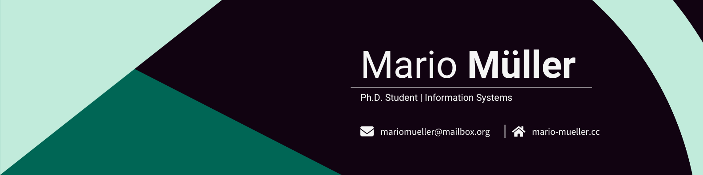

## Hi, I'm Mario 👋

I am a Ph.D candidate at the [Cologne Institute for Information Systems](https://ciis.uni-koeln.de) at the [University of Cologne](https://portal.uni-koeln.de/en/).

I study open source software ecosystems focusing on sustained participation of developers.

### What I Work With:

&nbsp;

&nbsp;
&nbsp;
&nbsp;
&nbsp;
&nbsp;
&nbsp;

&nbsp;
&nbsp;
&nbsp;
&nbsp;
